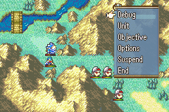
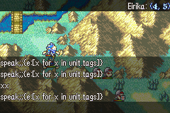

# Runtime Debugger

The runtime debugger is available only when the game's `debug` setting is enabled, but it does not open automatically when a game, Test Chapter, or Play session begins. On desktop, choose the `Debug` command from an in-game command menu or press `F11` to launch it in its own browser window. It remains open beside the game and does not capture or pause the game's keyboard, controller, or mouse input. Closing the game runtime also stops the local debugger service and closes its window.

Android uses a separate in-game drawer instead of an HTTP server or browser. Enable **Developer tools > Enable in-game debugger** in the Android build dialog before building the developer APK. The drawer occupies the right side of the game view, leaves the active map/base/prep screen visible, blocks gameplay input and fast-forward while it is open, and can be closed with its `X` or `BACK`. The drawer has a persistent Back control for nested pages, supports accelerated touch dragging and a draggable scrollbar for long unit/item/class/command lists, and keeps the Quick tabs below the header. Its Quick, Unit, World, and Event pages expose the same debugger operations as desktop. Tapping a text or manual-number field opens a compact white dialog at the upper-left of the game. The dialog grows to fit the current text, remains above the Android IME, and uses centered Cancel/Save buttons. It does not draw a duplicate QWERTY keyboard.

Every new runtime closes any debugger window left over from an earlier session. The old secret directional code no longer opens the debugger. When `debug` is disabled, the menu entry, F11, runtime hotkeys, HTTP service, and debugger window are all unavailable.

 

The left side of the debugger lists every unit currently loaded by the game. Moving the in-game cursor onto a unit automatically selects and scrolls to that unit in the debugger. Clicking a unit in the debugger moves the in-game cursor and camera to that unit. The debugger can:

- Complete the current chapter or move to any chapter in the project.
- Edit the selected unit's level, EXP, HP, mana, fatigue, guard gauge, movement, position, base stats, growths, cap modifiers, and weapon experience.
- Edit X/Y coordinates or enter a destination and teleport the selected unit.
- Give any project item to the selected unit, with its icon and a configurable number of uses.
- Max the selected unit, all player units, or all enemy units.
- Set every enemy unit's HP to 1 or change its combat and roaming AI to `None`.
- Set the current party's money.
- Change the current turn count and replace or clear the current map weather.
- Set the current Turnwheel uses and maximum Turnwheel uses to the same value, and enable or disable `_turnwheel` with a checkbox. A value of `-1` means unlimited uses.

Unit summaries refresh while the game runs. Numeric values are clamped to their valid engine range and commands are applied on the main game thread, rather than from the debugger's server thread.

For map-assisted teleporting, select a unit in the debugger and press `Pick from game`. The game enters a cursor mode with four translucent black corner panels, leaving the center of the map visible. The panels use the original debug HUD's white/yellow labels and blue values to display the current X/Y coordinates, terrain, regions, unit, team, HP, and controls. Press `SELECT` to send that tile back to the debugger, then press `Teleport`. The chosen destination remains fixed while the cursor moves elsewhere. Unit-selection sync is temporarily held after picking so a unit standing on the destination cannot replace the intended teleport subject. It resumes after teleporting or after explicitly selecting another unit in the debugger. Press `BACK` to cancel the picker without changing the destination.

## Runtime hotkeys

The following hotkeys work while the game window has focus:

- `Ctrl+1`: Max selected unit.
- `Ctrl+2`: Max all player units.
- `Ctrl+3`: Max all enemy units.
- `Ctrl+4`: Set every enemy unit's HP to 1.
- `Ctrl+5`: Set every enemy unit's AI to `None`.
- `Ctrl+0`: Complete the current chapter.

The same shortcuts are shown beside their corresponding buttons in the independent debugger window.

## Event command console

The independent window includes an event command console and a searchable `Show commands` browser sourced from the engine's current event-command catalog. Selecting a command shows its signature, category, optional flags, and full description. Double-click it or press `Insert template` to place an editable template in the console.

The command field uses the same validator-driven suggestions as the Event Editor. As each argument is typed, it offers the matching project units, items, classes, chapters, tilemaps, skills, flags, and other known values. Suggestions include display names and NIDs while inserting the NID required by the event command. Use the mouse or the arrow keys to select a suggestion, then press `Tab` or `Enter`; `Ctrl+Space` opens the suggestions manually.

The console calls a miniature event when you run a command. That event has access to:
> - **unit**: the unit currently selected in the debugger
> - **position**: that selected unit's position, if it is on the map

No unit or position is provided if the selected unit is off-map or unavailable.

Type any event command and press `Run` to queue it on the game thread. Try `give_item;Eirika;Vulnerary`, for example.
